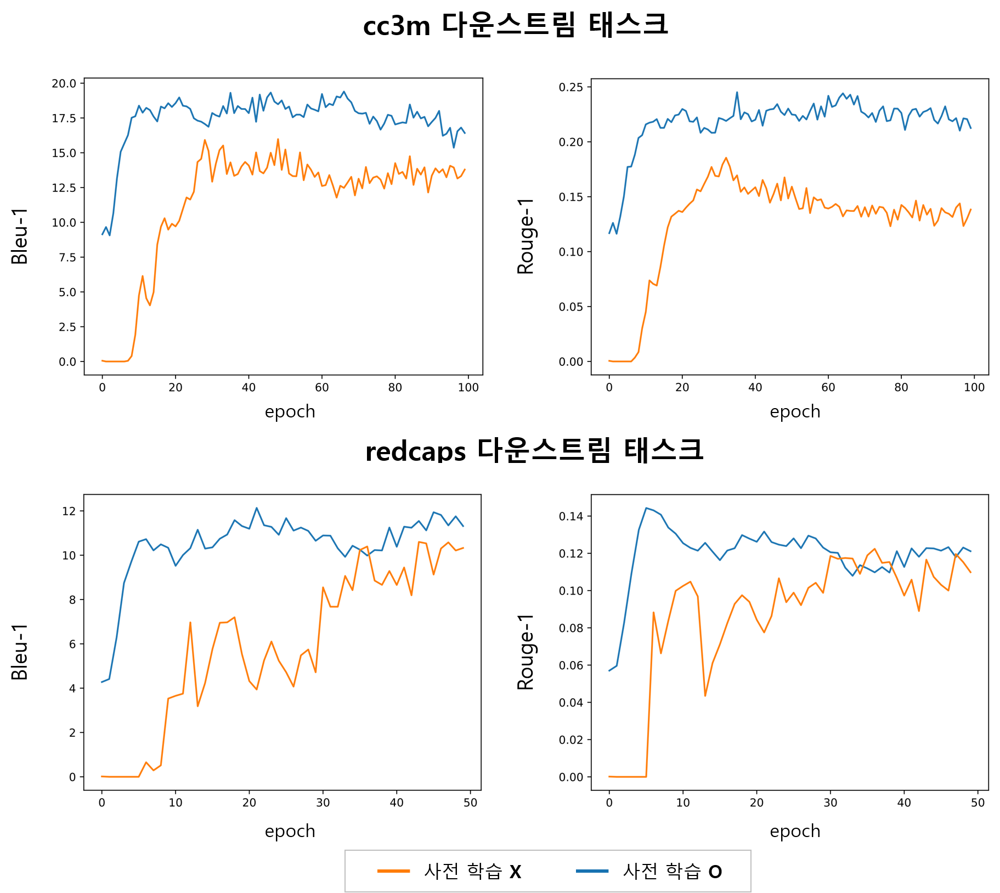

# Downstream task evaluations of a pretrained VL-KE-T5
이 repository는 사전 학습 된 [VL-KE-T5](https://github.com/AIRC-KETI/VL-KE-T5)의 실효성을 확인하기위해, downstream task에서의 성능을 평가하는 코드를 포함합니다.

사전 학습 모델의 성능은 downstream task에 대해 fine-tuning해봄으로써 평가할 수 있습니다. 사전 학습을 했을 때 downstream task의 성능이 사전학습 하지 않았을 때의 downstream task 성능보다 높으면 사전 학습이 효과적임을 뜻합니다.

이를 위해 사전학습된 VL-KE-T5와 그렇지 않은 VL-KE-T5를 두 가지 downstream task (cc3m, redcaps)에대해 fine-tuning해보고
성능을 비교해보았습니다.

## 필요 패키지 설치

```bash
    pip install torch
    conda install -c pytorch faiss-gpu # or faiss-cpu
    pip install transformers sentencepiece 
    pip python-mecab-ko nltk rouge_score
```

faiss의 자세한 설차 방법은 [FAISS](https://github.com/facebookresearch/faiss/blob/main/INSTALL.md)를 참고하시길 바랍니다.

## 학습 데이터 다운로드
- [cc3m](http://tmp)
- [redcaps](http://tmp)

## Fine-tuning 학습 
- 사전 학습 __된__ 모델로 fine-tuning 학습
```bash
bash scripts/run_veld_finetune_bg.sh # cc3m
bash scripts/run_veld_finetune_redcaps_bg.sh # redcaps
```
- 사전 학습 __되지 않은__ 모델로 fine-tuning 학습
```bash
bash scripts/run_veld_finetune_start_not_aligned_bg.sh # cc3m
bash scripts/run_veld_finetune_redcaps_start_not_aligned_bg.sh # redcaps
```
## Fine-tuning 평가
`<model_name>`에는 각 학습으로 부터 model_output에 생성된 폴더 이름이 들어간다.
```bash
bash scripts/run_veld_test_bg.sh ./model_output/<model_name> # cc3m
bash scripts/run_veld_test_redcaps_bg.sh ./model_output/<model_name> # redcaps
```

## 결과


- 미세 조정 중 테스트 데이터에 대한 bleu-1 및 rouge-1 점수 변화 (x축: epoch, y축: bleu-1 및 rouge-1).
- 사전학습을 사용한 경우 (사전학습 O)가 그렇지 않은 경우 (사전학습 X) 보다 적은 epoch 수로 성능이 향상되었으며, 수렴되는 성능 또한 사전학습을 사용한 경우가 높았다.

## Acknowledgement

본 연구는 정부(과학기술정보통신부)의 재원으로 지원을 받아 수행된 연구입니다. (정보통신기획평가원, 2022-0-00320), (정보통신기획평가원, 2022-0-00608), (정보통신기획평가원, 2021-0-00537), (정보통신산업진흥원, S0316-21-1002)

